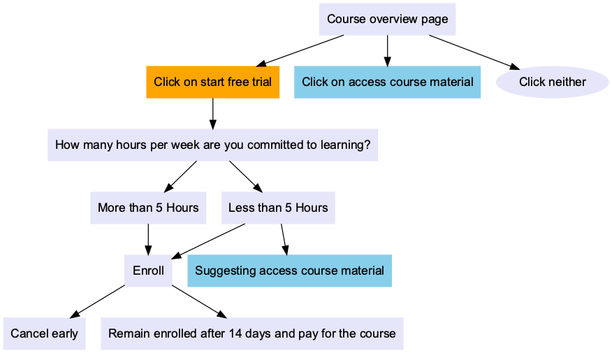

## [Udacity A/B Testing Final Project: Free Trial Screener](https://github.com/eeliuqin/data-analysis/blob/main/AB-Testing/Udacity-AB-Testing-Final-Project.ipynb) 
click [here](https://nbviewer.org/github/eeliuqin/data-analysis/blob/main/AB-Testing/Udacity-AB-Testing-Final-Project.ipynb) to view it in nbviewer

### Experiment

Udacity tested a change where if the student clicked start free trial, they saw a pop up modal that asked them how much time they had available to devote to the course. The critical value was 5 hours:

- If the student indicated 5 or more hours per week, they would be taken through the checkout process as usual.
- If they indicated fewer than 5 hours per week, a message would appear indicating that Udacity courses usually require a greater time commitment for successful completion, and suggesting that the student might like to access the course materials for free. At this point, the student would have the option to continue enrolling in the free trial, or access the course materials for free instead.

The workflow:

### Hypothesis 

This UI change might set clearer expectations for students upfront, thus reducing the number of frustrated students who left the free trial because they didn't have enough time—without significantly reducing the number of students to continue past the free trial and eventually complete the course.

**Null Hypothesis**: Control group and Experiment group have same Gross Conversion and Net Conversion rates.
**Alternative Hypothesis**: Control group and Experiment group have different Gross Conversion and Net Conversion rates.

### Data source
  - [Rough Estimates of the Baseline Values](https://docs.google.com/spreadsheets/d/1MYNUtC47Pg8hdoCjOXaHqF-thheGpUshrFA21BAJnNc/edit#gid=0): This spreadsheet contains rough estimates of the baseline values, we are going to use it for pre-test analysis, in other words, we will design the A/B test based on its data.
  - [Test Results](https://docs.google.com/spreadsheets/d/1Mu5u9GrybDdska-ljPXyBjTpdZIUev_6i7t4LRDfXM8/edit#gid=0): This spreadsheet contains the test results, we are going to analyze it to decide if the change has any effect.

### Results
- **Gross Conversion**: The difference is statistical significant, with a p-value 0.0026 lower than the rejection level 0.05.
- **Net Conversion**: The difference is not statistical significant, with a p-value 0.6776 higher than the rejection level 0.05.

After applying the change, enrollments has decreased but payments has no significant change.
